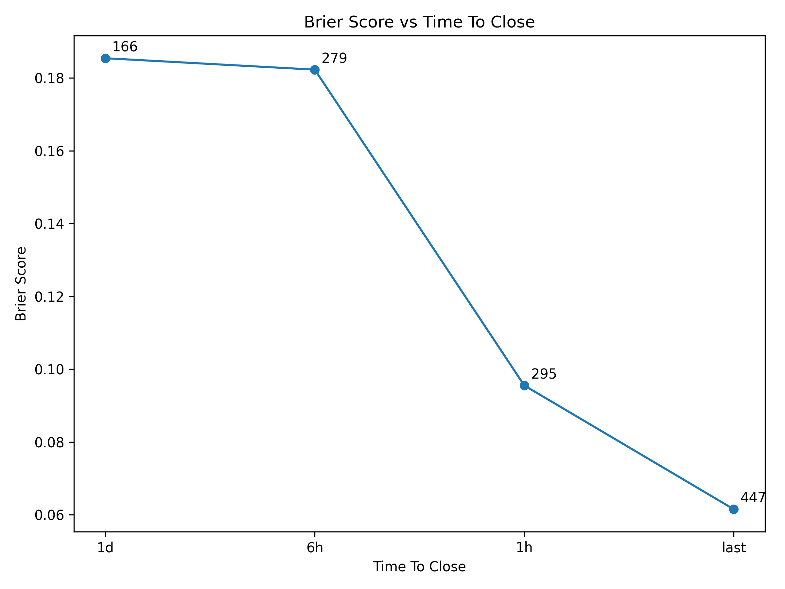
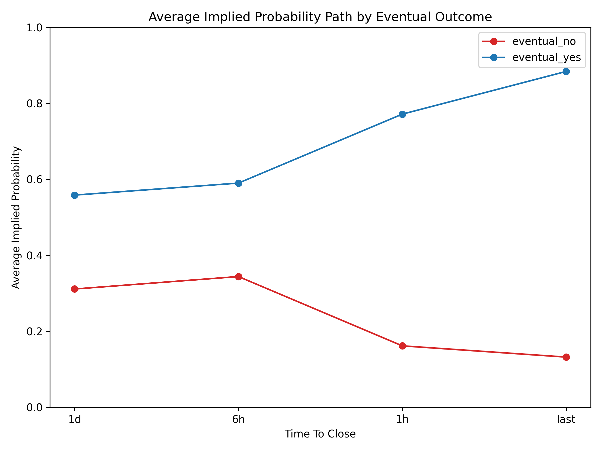
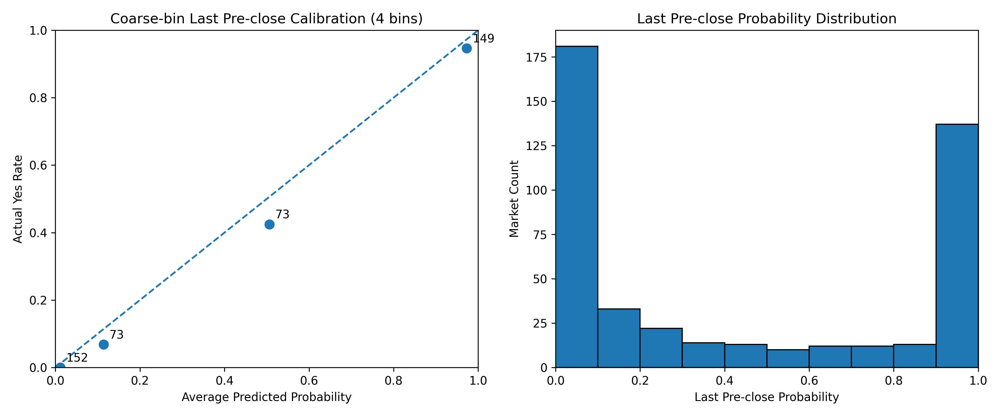

# Prediction Market Event-Time Study

Pilot event-time study of 600 stratified Kalshi binary markets. As resolution approached, prices became materially more informative: the last pre-close Brier score was `0.0615` on `447` matched markets, and average implied probabilities separated from `0.56 vs 0.31` at `1d before close` to `0.88 vs 0.13` at `last pre-close` for eventual Yes vs No outcomes. The matched sample varies by horizon because candle availability differs across markets.

## Overview

This project asks a market microstructure-style question:

> As resolution approaches, do prediction market prices become more accurate and separate more cleanly by eventual outcome?

Instead of evaluating calibration only at one static snapshot, this repository aligns markets in event time and measures how implied probabilities evolve at fixed horizons before close.

## What This Repo Does

- Builds a metadata-only universe of resolved Kalshi markets over a fixed event window.
- Draws a stratified sample of `600` markets by resolution month and liquidity bucket.
- Downloads candlesticks only for sampled tickers.
- Extracts implied probabilities at `1d`, `6h`, `1h`, and `last pre-close`.
- Evaluates accuracy with Brier score and MAE, path separation by eventual outcome, and coarse-bin calibration near close.

## Data And Method

1. Collected public Kalshi historical and settled-market metadata for markets resolving between `2025-04-01` and `2026-03-31`.
2. Filtered to resolved binary markets with explicit Yes/No outcomes and valid open/close timestamps.
3. Drew a stratified sample of `600` markets using `resolution month x liquidity bucket`.
4. Downloaded hourly candlesticks only for sampled tickers.
5. For each market, extracted the nearest available probability at:
   - `1d_before_close`
   - `6h_before_close`
   - `1h_before_close`
   - `last_preclose`
6. Computed:
   - Brier score
   - mean absolute error
   - average implied-probability path by eventual outcome
   - last-preclose calibration bins

## Sample Construction

The sample-construction table is saved at `data/processed/event_time_sample_construction_table.csv`.

All counts below are unique `ticker` counts, not raw API row counts.
The separate crawl volume from the metadata build is tracked in `data/processed/event_time_universe_build_stats.json`.

- Unique markets in the fixed date window: `5,672,782`
- Unique resolved binary Yes/No markets: `5,664,903`
- Unique markets with valid open/close times: `317,072`
- Unique stratified sample drawn: `600`
- Unique sampled markets with candlesticks retrieved: `600`
- Matched markets at `1d_before_close`: `166`
- Matched markets at `6h_before_close`: `279`
- Matched markets at `1h_before_close`: `295`
- Matched markets at `last_preclose`: `447`

## Key Findings

The metrics table is saved at `data/processed/event_time_metrics_by_timepoint.csv`.

### Accuracy Near Close

| Timepoint | Matched Markets | Brier Score | MAE |
| --- | ---: | ---: | ---: |
| 1d before close | 166 | 0.1854 | 0.3630 |
| 6h before close | 279 | 0.1823 | 0.3707 |
| 1h before close | 295 | 0.0955 | 0.1904 |
| Last pre-close | 447 | 0.0615 | 0.1257 |

The cleanest signal appears in the final hour and especially at the last pre-close observation. These matched counts differ by horizon because some markets do not have a usable candle inside every tolerance window.

### Path Separation By Eventual Outcome

The average-path table is saved at `data/processed/event_time_average_path_by_outcome.csv`.

- `eventual_yes` average implied probability rises from `0.5583` at `1d_before_close` to `0.8838` at `last_preclose`.
- `eventual_no` average implied probability falls from `0.3111` at `1d_before_close` to `0.1319` at `last_preclose`.
- The Yes/No separation gap widens from roughly `0.25` to `0.75` as markets approach resolution.

### Coarse-Bin Last Pre-Close Calibration (4 bins)

The coarse-bin calibration table is saved at `data/processed/event_time_last_preclose_calibration.csv`.

- The lowest-probability bin averaged `0.0116` and had an actual Yes rate of `0.0000`.
- The highest-probability bin averaged `0.9730` and had an actual Yes rate of `0.9463`.
- The middle bin averaged `0.5064` and had an actual Yes rate of `0.4247`, suggesting weaker calibration away from the extremes.

## Figures

### Brier Score Vs Time To Close



### Average Probability Path By Eventual Outcome



### Coarse-Bin Last Pre-Close Calibration (4 bins)



## How To Run

```bash
python3 -m venv .venv
source .venv/bin/activate
pip install -r requirements.txt
python src/build_universe.py
python src/draw_stratified_sample.py
python src/download_sample_candles.py
python src/extract_timepoint_probs.py
python src/compute_metrics.py
python src/plot_brier_vs_time.py
python src/plot_average_paths.py
python src/plot_last_preclose_calibration.py
```

## Repo Outputs

- `data/processed/event_time_stratified_sample.csv`
- `data/processed/event_time_stratum_allocation.csv`
- `data/processed/event_time_sample_candle_download_summary.csv`
- `data/processed/event_time_timepoint_probabilities.csv`
- `data/processed/event_time_metrics_by_timepoint.csv`
- `data/processed/event_time_average_path_by_outcome.csv`
- `data/processed/event_time_last_preclose_dataset.csv`
- `data/processed/event_time_last_preclose_calibration.csv`
- `data/processed/event_time_sample_construction_table.csv`
- `data/processed/event_time_universe_build_stats.json`
- `results/event_time_brier_vs_time.png`
- `results/event_time_average_paths.png`
- `results/event_time_last_preclose_calibration.png`

## Limitations

- The final matched sample differs by timepoint because some markets do not have a usable candle near every target horizon.
- The current design uses the nearest available candle within a fixed tolerance window rather than an exact time-to-close match.
- The large raw universe file and raw candlestick JSON files are intentionally not tracked in Git because they are rebuildable and too large for a clean repository.
- These results should be interpreted as an empirical project result for this sampled design, not as a universal statement about all prediction markets.

## Future Work

- Repeat the study with multiple random seeds for the stratified sample.
- Compare event-time behavior across market categories.
- Test additional horizons and alternative candle-resolution choices.
